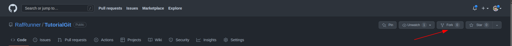

# Tutorial de git/GitHub

Olá! Nesse repositório temos como objetivo fornecer um projeto extremamente simples (apenas dois arquivos) em python usando conceitos muito simples da linguagem para ter o maior nível de acessibilidade possível.

Com esse projeto podemos demonstrar as funcionalidades mais básicas do git: clone, branch, add, commit, push, pull, merge etc incentivando os participantes a clonarem o projeto, fazerem modificações em suas próprias branches/repositórios e depois commitar e pushar para um repositório git remoto (no caso, no GitHub). Utilizaremos também a funcionalidade de fork e merge requests para dar uma ideia de como é o processo para contribuir em projetos open source (código aberto).

## O que é o git? Pra que ele serve? É a mesma coisa de GitHub?

Git é um software para controle de versionamento distribuído. O que isso significa? Significa que você, juntamente com outros contribuidores, pode manter controle de um repositório (projeto) tendo acesso a cada versão incremental do programa. Cada mudança incremental do programa é chamada de "commit" e todos podem ter acesso a cada commit juntamente com quem o fez, quando foi feito, uma mensagem explicativa entre outras informações. Como cada commit é incremental, podemos "voltar no tempo" no projeto, vendo ele em cada um se seus estágios e cada mudança, como se tivéssemos acesso a todas as versões já salvas de cada arquivo. Isso é um software de controle de versionamento.

Agora, o que significa ele ser distribuído? Um dos principais (se não o principal) objetivo do git é facilitar que diversas pessoas trabalhem simultaneamente em um mesmo projeto (muitas vezes no mesmo arquivo) porém não em tempo real, como no Google Docs. Dessa forma, para evitar os chamados conflitos, cada desenvolvedor cria uma "cópia" do projeto própria para desenvolver uma nova funcionalidade ou corrigir um bug. Ele faz modificações (commits) nessa ramificação (chamada branch) para que seu trabalho não interfira com o código principal até que fique 100% pronto. Assim que o objetivo da ramificação for cumprido, o desenvolvedor propõe que sua branch seja mesclada (chamado merge) na ramificação principal (geralmente chamada de main ou master). Outros contribuidores analisam se as mudanças são desejadas e corretas e então podem fazer o merge, levando todos os commits (logo, as modificações) para a ramificação principal. Note que merges não precisam ser feitos somente para a branch principal. Qualquer branch pode ser mesclada em qualquer outra.

Porém, vamos supor que enquanto o desenvolvedor A trabalhava em um arquivo, um outro desenvolvedor B modificou o mesmo arquivo, ambos modificaram a mesma linha e as mudanças do desenvolvedor B já estão na branch principal. Nessa caso o git não consegue saber qual a versão correta da linha, e portanto o conflito deve ser resolvido manualmente. Isso é feito fazendo o merge na direção contrária (da branch principal para a branch do desenvolvedor A) e então decidindo qual das duas versões da linha é a correta ou a reescrevendo de forma que funcione com ambas as modificações antes do merge ser feito. Após essas correções é feito um commit e o merge pode seguir normalmente.

Além disso, como o git não é um software que funciona em tempo real, quando você "clona" um repositório (baixa um projeto) você terá uma cópia local de todas as informações do repositório remoto. Quando você criar um branch para trabalhar, ela inicialmente será apenas local, assim como qualquer commit que você fizer. Para que suas modificações sejam levadas até o repositório remoto (onde outras pessoas poderão ver, analisar e usar o seu código modificado) é necessário fazer o chamado "push". Da mesma forma, é necessário atualizar sua versão local do repositório remoto. Isso é feito fazendo um "fetch" (atualizando as informações sobre o repositório remoto) e um pull (atualiza a sua branch atual com todos os novos commits).

E agora você me pergunta: então o que é o GitHub? Simples, é necessário um servidor para hospedar o repositório remoto do git para que todos os desenvolvedores tenham acesso a ele. O GitHub é um dos serviços que proveem isso e outras funcionalidades bônus como: revisão (e até edição) de código, resolução de conflitos, criação de projetos, criação de ramificações, solicitações de merge, navegação pelo código e muitas outras no próprio site, sem a necessidade de clonar o projeto localmente. Ou seja, o GitHub é nada mais nada menos que um servidor onde são hospedados diversos projetos versionados pelo git com outras funcionalidades para facilitar a vida dos desenvolvedores. Eles não são a mesma coisa, são complementares. Existem outros sites de hospedagem de projetos git que de certa forma competem com o GitHub, como o GitLab, Assembla, Bitbucket e outros.

## Como usar o git

A melhor forma de aprender a usar o git, é usando a linha de comando. Dessa forma, independentemente do editor de texto, sistema operacional ou até mesmo se você tem ou não acesso a uma interface gráfica (como em um servidor) você não estará perdido e vai conseguir fazer o que quer. É a melhor forma de entender os conceitos e o que realmente o git faz, mas não há problema algum em usar o git por uma interface gráfica depois de aprender os principais comandos e conceitos. Esse guia foi feito em um sistema Linux, porém os processos podem ser replicados no Windows e MacOS sem problemas.

Lembre-se que você sempre pode pesquisar na internet como fazer certas coisas, a sintaxe pode ser um pouco complicada, mas para isso é bom entender os conceitos do git para saber o que pesquisar. O git também tem uma documentação própria muito boa. Para utiliza-la basta adicionar a opção `--help` no fim de algum comando. Por exemplo:

    git --help

irá te mostrar os comandos existentes do git e as possessives opções. Para ver ajuda de um comando específico, coloque o nome do comando antes de help, como:

    git commit --help

Além disso, eu te recomendo criar um arquivo de texto onde você anotará os comandos que considerar mais importantes, juntamente com a explicação de cada um nas suas palavras. Esse arquivo será um recurso muito importante ao londo da sua jornada.

Antes de mais nada, você primeiro deve configurar qual será seu nome e email de forma global (para todos os projetos que você trabalhar no computador atual) no git. Eles serão usado para te identificar entre os commits e contribuidores de um projeto. Caso você já tenha uma conta no GitHub, é bom que você use o mesmo email que sua conta, e de preferência use seu nome completo ou primeiro + último nome como o nome:

    git config --global user.name "Seu nome completo"
    git config --global user.email "Seu email"

Ok, então para começar a usar o git você precisa criar um repositório git ou clonar um já existente. Vamos começar criando um do zero. Navegue até a pasta onde você quer criar o repositório pelo terminal e então execute:

    git init

Isso irá criar uma pasta escondida, a `.git`, onde o git guardará informações relevantes do projeto. Não mexa nessa pasta manualmente!

Agora crie um arquivo qualquer, pode ser um README.md (arquivo no formato markdown presente em quase qualquer projeto, que geralmente contêm descrições de como instalar, compilar ou contribuir para o projeto) e insira algumas linhas de texto quaisquer. Por padrão, o git não irá "acompanhar" novos arquivos criados no projeto. Execute `git status` e veja que o arquivo aparece abaixo de "Untracked files". Para adicionar o arquivo no projeto, é necessário usar o comando:

    git add README.md

Execute novamente o `git status` e note que o arquivo aparece agora sob "Changes to be committed" com a cor verde. É bom saber que, caso você não queira digitar o nome do arquivo criado ou adicionar múltiplos arquivos ao mesmo tempo você pode executar o comando acima como `git add .` , porém tome cuidado para não adicionar arquivos sem querer.

Outro ponto importante, é que antes de fazer um commit é necessário fazer o "staging" das suas modificações, ou seja, confirmar quais modificações (no caso por arquivo) você quer que sejam commitadas. O git faz isso para que seja possível fazer um commit sem incluir todas as modificações atuais. Isso é feito através do comando `git add` que acabei de apresentar. Ou seja, antes de fazer um commit, você precisar rodar um `git add` citando os arquivos que quer commitar.

Assim que estiver satisfeito com suas modificações, vamos criar um commit. Para isso, usamos o comando:

    git commit -m "Sua mensagem de commit aqui"

Para confirmar que o commit foi feito, é bom executar o comando

    git log

Ele irá te mostrar uma lista com cada commit na branch atual (que, caso você tenha seguido o tutorial até aqui, é a principal e a única que existe) com informações como o hash, nome e email do autor (por isso a importância de configura-los), data e hora do commit e a mensagem de commit. Caso queira ver uma versão resumida do log, use `git log --oneline` onde só será mostrado o hash e a mensagem de cada commit.

Agora, faça algumas modificações no arquivo README: adicione linhas, remova linhas, edite linhas, faça o que desejar. Caso queira você pode também adicionar um novo arquivo qualquer. Após salvar os arquivos, para ver exatamente quais mudanças foram feitas, execute: `git diff`. Você deve ver uma saída como:

Note que o `git diff` mostra somente modificações em relação ao commit anterior de arquivos modificados mas que ainda não passaram por staging (ou seja não foram adicionados pelo `git add`). Caso você queira ver modificações que já foram para staging, execute:

    git diff --staged

E caso queira remover um arquivo do staging (pois não deseja que ele entre no commit), execute:

    git reset nome_arquivo

Caso queira desfazer todas as suas modificações e voltar ao mesmo estado commit anterior (mas cuidado, você perderá todo o seu progresso, mesmo que tenha salvado os arquivos!):

    git reset --hard

Caso você tenha cometido algum erro no seu último commit, você pode desfazê-lo e trazer todas as modificações de volta para o staging com:

    git reset --soft HEAD~1

Porém cuidado! No git, geralmente é bom imaginar que, uma vez criado, todo commit é permanente, pois eles já podem ter sido baixados por outros desenvolvedores, mas existem casos em que é necessário desfazer um ou mais dos commits mais recentes, porém isso deve ser feito apenas se você ainda não tiver feito o push desse commit a ser desfeito ou esteja em uma branch em que somente você está trabalhando. Entrarei em mais detalhes sobre esses conceitos na próxima seção.

Outra coisa importante: muitas vezes, existem arquivos dentro do projeto que não queremos incluir no git, por serem dependências muito grandes, arquivos de configuração do editor que variam de desenvolvedor para desenvolvedor ou mesmo arquivos com dados sensíveis, como senhas ou chaves de APIs. Para evitar que os arquivos sejam adicionados no git, deve ser criado o arquivo `.gitignore` . Nesse projeto, temos esse arquivo, ele tem uma linha com `__pycache__/`, o que significa que todas as pastas com esse nome serão ignoradas, já que são apenas caches do python. Leia mais sobre esses arquivos e o que pode ser feito neles no seguinte link (em inglês):

https://gist.github.com/jstnlvns/ebaa046fae16543cc9efc7f24bcd0e31

Agora você já tem o básico para usar o git localmente. Na próxima parte, você irá aprender a usar o GitHub (e qualquer outro servidor de git) e trabalhar com projetos remotos e com outros desenvolvedores.

### O stash

Existem algumas ocasiões em que você tem arquivos modificados localmente e precisa fazer uma operação onde não podemos ter arquivos modificados (como dar checkout em outra branch ou executar um `git pull`) e também não é conveniente ou possível fazer um commit. Para isso, existe o stash: um local onde armazenamos modificações não commitadas em arquivos para deixar nosso ambiente "limpo" e podemos aplicá-las mais tarde.

O stash é uma espécie de pilha (stack), onde você pode empilhar várias alterações. Quando você executa o comando `git stash save` ou `git stash` o Git criará um novo stash e o adicionará no topo da pilha. Você também pode fornecer uma mensagem descritiva opcional para identificar facilmente as alterações salvas.

Após salvar as alterações, você pode alternar para outra branch usando o comando "git checkout" ou realizar outras operações sem se preocupar em perder as alterações não commitadas. Quando você estiver pronto para voltar para as alterações salvas, poderá usar o comando `git stash apply` ou `git stash pop`. O `apply` aplicará as alterações do stash no diretório de trabalho atual, mantendo o stash intacto, enquanto o "pop" aplicará as alterações e removerá o stash da pilha.

Além disso, você pode listar todos os stashes disponíveis usando o comando `git stash list` e escolher qual stash deseja aplicar com base em seu índice na pilha (usando `git stash apply stash@{índice}`). Você também pode descartar um stash específico usando o comando `git stash drop` seguido pelo índice do stash ou limpar toda a pilha de stashes usando `git stash clear`.

Em resumo, o comando `git stash` é uma ferramenta poderosa para salvar alterações não commitadas temporariamente, permitindo que você mude de contexto rapidamente sem perder o trabalho em progresso. Ele oferece flexibilidade e conveniência ao lidar com várias tarefas simultaneamente ou quando você precisa alternar entre ramos rapidamente.

## Como usar o GitHub (e repositórios remotos do git de forma geral)

Agora que você já tem uma noção de como usar o git localmente, é importante ter as noções básicas de como usar o GitHub (e caso você saiba como usar o GitHub, você rapidamente aprenderá a usar qualquer repositório de git online). Primeiro, para clonar um repositório git, você precisa do seu link do git. Ele pode ser encontrado em:

Idealmente você deve utilizar links do protocolo "SSH", pois é uma forma melhor de se identificar em repositórios online sem precisar se autentificar com usuário e sem toda vez. Porém esse protocolo pode falhar em projetos que você não tem permissão para editar diretamente ou caso você configure suas chaves ssh incorretamente. Para fazer isso, siga o tutorial do próprio GitHub:

https://docs.github.com/en/authentication/connecting-to-github-with-ssh

Copiar diretamente o link de um repositório público de outro usuário como na imagem é ok caso você queira somente utilizar ou estudar o código ou fazer apenas modificações locais. Agora, caso você queira salvar no próprio GitHub suas modificações criando uma versão sua do projeto (cheque a licença antes de fazer isso) ou sugerir modificações para o projeto original, você deve fazer um "fork" (bifurcação) do projeto antes:

Com isso basta confirmar se todas as informações estão corretas e uma cópia do projeto original será criado para seu usuário! Copie então o link do repositório que está em seu novo para prosseguir.

Quando você tiver o link do repositório copiado, navegue pelo terminal até o local onde quiser salvar o projeto (muitas pessoas gostam de criar um pasta github/ para isso) e execute:

    git clone <link do reposiório.git>

Esse comando deve criar uma pasta com o nome do projeto onde ele foi executado, você deve então navegar até a pasta do projeto para poder trabalhar nele. Falamos um pouco sobre branches na introdução, então agora vamos aprender a trabalhar com elas: Para saber em qual branch você está, você pode usar o próprio comando `git status`:

Como podemos ver, estamos na branch master e tudo está atualizado com o repositório remoto. Mas veja, o git julga que estamos atualizados com base na cópia do repositório remoto que temos localmente, para saber se realmente estamos atualizados, devemos sempre executar periodicamente `git fetch`, esse comando irá nos avisar quando algo foi alterado no repositório remoto, e podemos puxar essas modificações para nossa versão local com o comando `git pull`, mas lembre-se de somente executar o comando pull quando você não tiver nenhuma modificação local não commitada, ou ele irá falhar. Mesmo assim, existe a chance de nos depararmos com um conflito, mas tratarei disso futuramente.

É sempre bom verificar quais outras branches existem em um projeto. Para isso podemos usar:

    git branch          # listará somente as branches locais
    git branch -a       # listará todas as branches, locais e remotas
    git branch -r       # listará somente as branches remotas

Como vemos nas saída do comando, as branches remotas são as que iniciam com `remotes/` e são seguidas, nesse caso de `origin/` (quase sempre, o nome do repositório remoto padrão será "origin", mas nem sempre isso é verdade). As branches remotas são aquelas que tem somente o seu nome, e o * serve para marcar em qual branch estamos atualmente. Note que temos duas branches master! uma local e uma remota, pois, como disse, o git não faz alterações em tempo real no repositório remoto, e as duas se comportam como entidades diferentes. Você não pode dar "checkout" em uma branch remota diretamente (não pode alterá-la diretamente) mas pode criar uma cópia local da mesma e "empurrar" (push) suas alterações para o remoto.

Vamos dar checkout na branch mais-operações:

    git checkout -b mais-operações origin/mais-operações

Como não temos uma cópia local dessa branch, precisamos da flag `-b <nome da branch>` para indicar que queremos criar uma nova branch local com esse nome baseado na branch remota `origin/mais-operações`. Os nomes das branches locais e remotas não precisam coincidir, mas é sempre bom que coincidam. Veja que alguns arquivos foram alterados. Execute novamente os comandos `git status` e `git branch -a` para ver o que mudou. Para voltar à branch master (e para trocar para uma branch local qualquer) o comando é mais simples:

    git checkout master

Ok, agora vamos criar uma nova branch para fazer nossas modificações. Por padrão, você nunca deve trabalhar na branch principal do projeto (geralmente chamada master, main, develop, etc) para garantir que a branch principal sempre esteja 100% funcional, portanto criamos uma branch nova e damos checkout para ela com:

    git checkout -b nova-branch

Faça as modificações que desejar, e crie um commit seguindo o guia anterior. Agora, você precisa "empurrar" suas modificações para o repositório remoto:

    git push --set-upstream origin nova-branch

Note que tudo após `git push` só é necessário caso a branch não exista ainda no remoto (ou seja, no primeiro push).

Perfeito! Agora as modificações já estão na nova branch. Assumindo que tudo esteja funcionando como desejado, o próximo passo é fazer um chamado "pull request" (as vezes chamado de "merge request") da sua branch para a master. Essa solicitação de mesclagem serve para indicar que você acredita que o que está nessa branch é desejado pelo projeto e deve estar na master, e em projetos grandes são revisadas por outras pessoas, que irão aceitar ou não a solicitação, fazendo críticas e sugestões. Quando estiver trabalhando sozinho, você mesmo deve aceitar suas solicitações de mesclagem.

Nessa página podemos selecionar quais duas branches estamos comparando (veja que aqui queremos fazer a mesclagem da "mais-operações" na "master"). Caso você tenha feito um fork de outro projeto, deve selecionar se está fazendo uma solicitação de merge para o repositório original (ou seja, você irá sugerir mudanças no projeto original e deve garantir que está seguindo todas as diretrizes do projeto) ou para a sua própria versão do projeto. Você pode ver também um resumo dos arquivos alterados e uma comparação linha a linha do que foi modificado, para garantir que estamos criando a solicitação corretamente. Confirmando a criação do pull request, você deve escolher um título e descrição que façam sentido para o que está sendo modificado (assim como uma explicação detalhada do que está sendo feito caso esteja trabalhando em um projeto grande). O que levará a uma tela que indica se o merge pode ser feito sem conflitos ou não assim como todo um histórico daquela solicitação. Se estiver tudo ok, clique em "Merge pull request".

Pode ser que você encontre conflitos, caso sim, algo como isso deve aparecer no resumo do pull request:

Clique para resolver conflitos e você será levado a uma página semelhante a um editor de texto, onde você deve, manualmente, passar por cada arquivo com conflito e os marcar como resolvidos:

Os conflitos mostram as verões daquela parte do código em ambas as branches, e o seu dever é reescrever aquele trecho de forma que incorpore as mudanças de ambas as partes (sim, é algo bem manual) e no fim apagar todos os ">>>>>>>>>>>>" e "<<<<<<<<<<<", clicando em "Mark as resolved". Isso irá criar um novo commit na branch que está indo para a master com as resoluções, permitindo o merge.

É também possível resolver conflitos pelo editor de texto/ide localmente. Alguns tornam esse processo bem mais simples e outros bem mais complicado, portanto deixo com você pesquisar e aprender como fazer isso localmente.

E é isso! Agora você sabe como criar repositórios git locais, trabalhar com commits e branches, baixar um repositório público ou criar uma bifurcação dele e seguir trabalhando seja na sua versão, ou criando sugestões para o projeto original! Lembre-se, a documentação do próprio git é extremamente completa, e você sempre deve buscar guias e tutoriais para casos específicos que estiver enfrentando, essa é apenas uma introdução para te familiarizar com os conceitos. Não se esqueça também de manter um arquivo com os comandos mais úteis e resoluções para situações que encontrar.

### Colocando um projeto local no GitHub

Até agora, focamos em como contribuir e usar um repositório de terceiros no GitHub. Porém, de igual importância, é necessário saber como colocar um projeto já existente (ou novo) no GitHub.

Primeiro, é necessário seguir os passos delineados no início para criar um repositório git, podendo ser na raiz da pasta de um projeto já existe ou em uma pasta vazia na qual você irá criar o projeto:

    git innit
    git add .
    git commit -m "Primeiro commit"

Importante: antes de executar `git add` e `git commit`, verifique se o projeto não possui arquivos com dados sensíveis, pastas de dependência/saída de compilação ou outros arquivos que não devem ser adicionados no repositório. Se existem, crie um arquivo `.gitignore` o configurando para ignorá-los.

Após isso feito, clique em vá até o seu perfil no GitHub > Repositórios > Novo Repositório, e crie um repositório vazio (não adicione licença, README ou .gitignore, já que isso pode atrapalhar seu primeiro commit e pode ser feito mais tarde). Não se esqueça de selecionar corretamente se deve ser um repositório público ou privado. Após isso feito, você deve ter um repositório totalmente vazio:

Após isso feito, copie o link do repositório (nesse caso `git@github.com:RafRunner/ExemploVazio.git`) e vá até o terminal no seu repositório novo:

    git remote add origin <link do repositório>
    git push -u origin main # ou master, mas main é novo padrão

Volte ao GitHib e recarrega a página e voilà! Seu código agora está no GitHub! Após a primeira vez, não é necessário a parte `-u origin` do `git push`, ela serve para falar para o git que a branch atual deve estar em sincronia com a branch `main` do remoto `origin`, sendo necessária somente quando você for criar uma nova branch. Agora basta seguir as boas prática do GitHub, como adicionar uma licença para especificar como seu código pode ser usado, seguir as diretrizes da comunidade, não enviar dados sensíveis, evitar trabalhar diretamente na branch principal e etc.

### Notas sobre trabalhar em forks:

Quando vamos fazer modificações em um fork que desejamos que sejam aplicadas no repositório original, é ideia que criemos outra branch que não a master/main ou qualquer que seja a branch da qual vamos nos basear. Isso é o ideal pois, caso o projeto original atualize algo na branch na qual você se baseou, você poderá facilmente atualizar a sua branch com essas modificações, o que não seria possível caso você estivesse modificando a mesma branch.

Para se manter atualizado com o repositório original, copie o link do repositório original e execute

    git remote add upstream <link do repositório original>
    git fetch upstream

Upstream aqui indica que esse é o remoto "acima da corrente", ou seja, o original do qual nos baseamos para criar o nosso. A partir disso, podemos criar versões locais das branches do repositório original para mantermos as nossas branches atualizadas:

    git checkout -b upstream_master upstream/master

Esse comando irá criar uma branch local que é o espelho da branch master do repositório original. Note que, como não temos acesso ao repositório original, não podemos dar push nessa branch, e ela deve ser mantida sem modificações, apenas servido para nos manter atualizados. Podemos então fazer `git merge upstream_master` enquanto na nossa própria master para atualizá-la, e então `git checkout minha_branch` `git merge master` para atualizar a branch em que estivermos trabalhando.

Lembre-se de não modificar a branch principal diretamente, para que sempre seja possível atualizar seu projeto com o upstream, e peridicamente execute:

    git fetch upstream
    git checkout upstream_master
    git pull
    git checkout master
    git merge master_upstream

E atualize outras branches em que estiver trabalhando, cuidando para resolver corretamente eventuais conflitos. Ao realizar o merge pela linha de comando (com `git merge`) temos que resolver o conflitos localmente. Como fazer isso depende um pouco de qual editor de texto estiver usando como o padrão do git, mas de forma geral, veja como em:

[Resolvendo conflitos localmente](https://docs.github.com/en/pull-requests/collaborating-with-pull-requests/addressing-merge-conflicts/resolving-a-merge-conflict-using-the-command-line)

## Informações

Esse repositório foi inicialmente criado com o propósito de servir como um mini curso/palestra organizado pelo Centro Acadêmico do curso de Engenharia da Computação da Universidade Federal de Goiás, idealizado por Rafael Nunes Santana.
